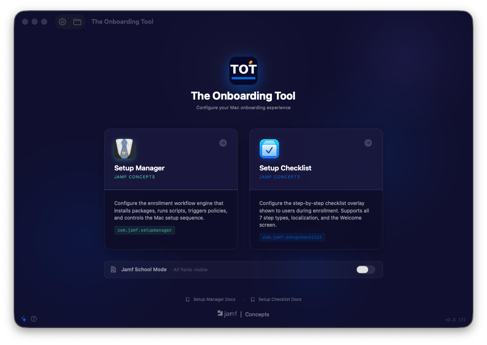
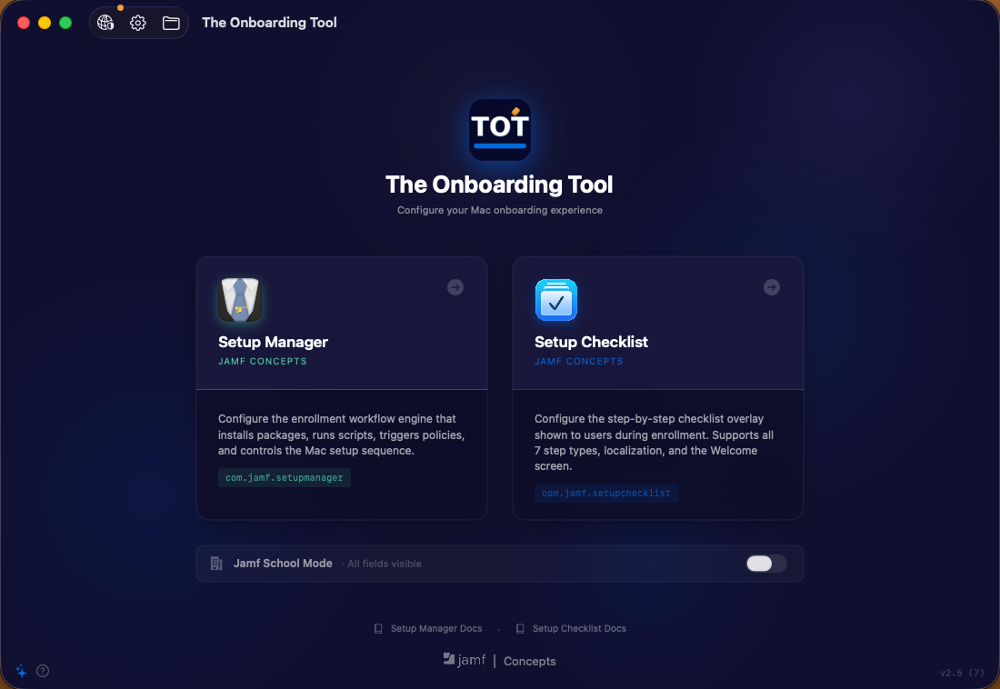
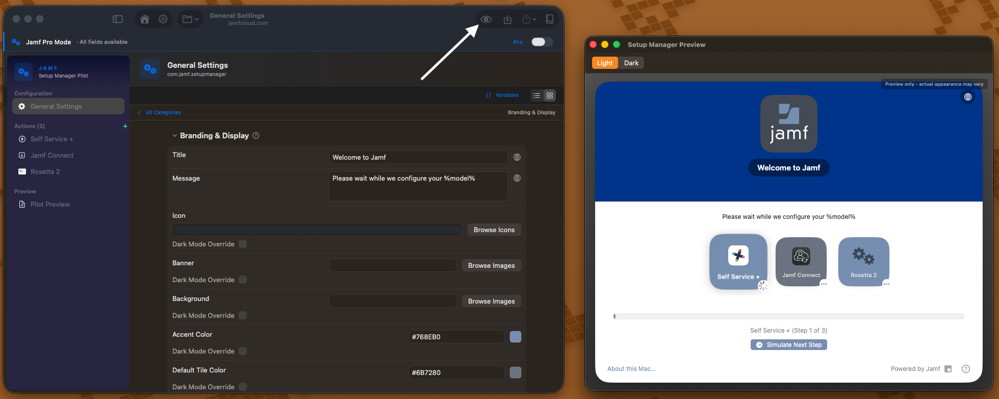
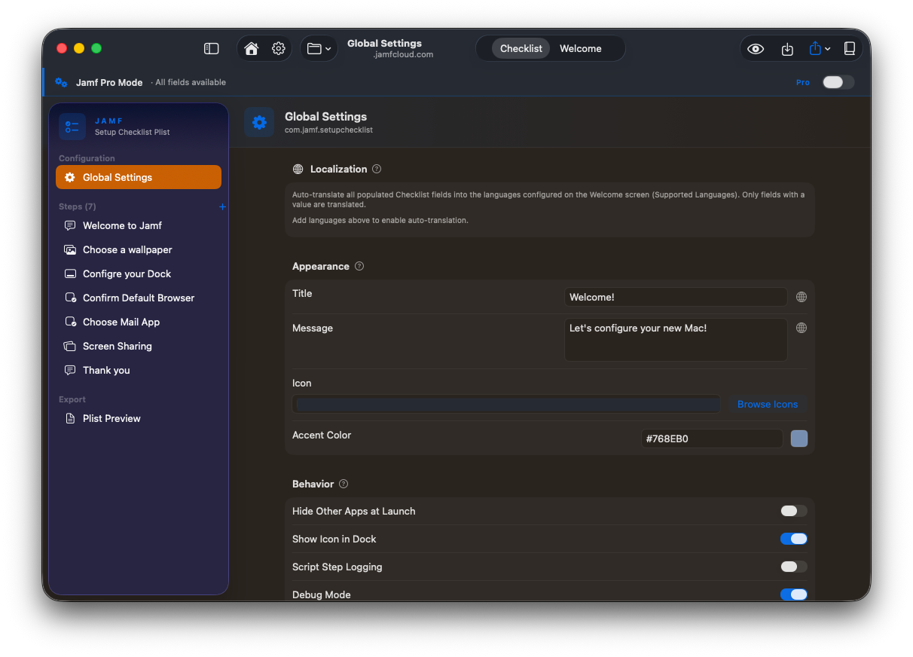
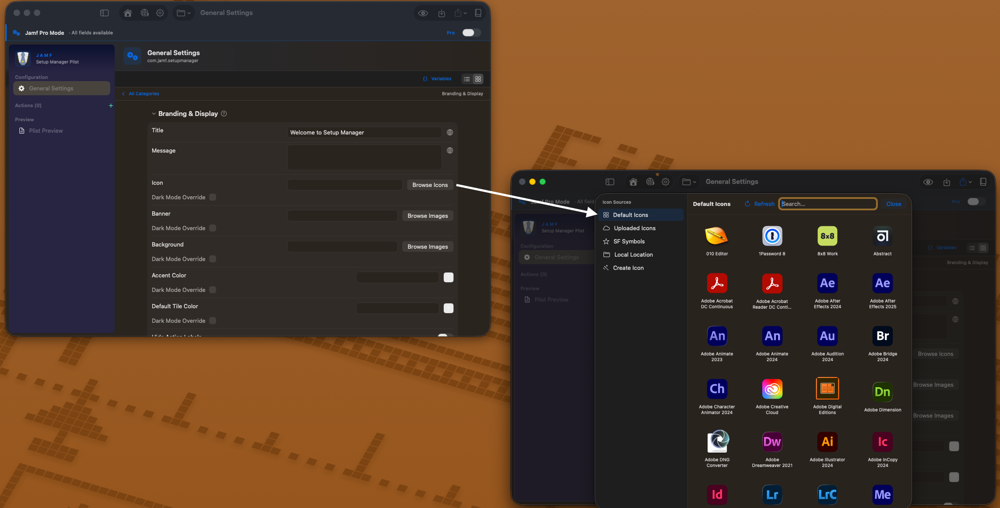

<!-- Add the app icon here once it's in the repo, e.g. Screenshots/AppIcon.png -->
<!--  -->

# The Onboarding Tool from Jamf Concepts

> **A faster, friendlier way to build Jamf Mac onboarding configurations. No XML required.**

---

## Table of contents

1. [Overview](#overview)
2. [Requirements](#requirements)
3. [Installation](#installation)
4. [First launch](#first-launch)
5. [Connecting Jamf Pro](#connecting-jamf-pro)
   - [Creating an API role and client](#creating-an-api-role-and-client)
   - [Required permissions](#required-permissions)
   - [External services](#external-services)
6. [What you can build](#what-you-can-build)
7. [Previewing before you deploy](#previewing-before-you-deploy)
8. [Exporting and deploying](#exporting-and-deploying)
9. [Documentation](#documentation)
10. [Credential storage and security](#credential-storage-and-security)
11. [Privacy and analytics](#privacy-and-analytics)
12. [Troubleshooting](#troubleshooting)
    - [Logging](#logging)
13. [Dependencies and Software Bill of Materials](#dependencies-and-software-bill-of-materials)
14. [Terms of Use](#terms-of-use)
15. [Help and Feedback](#help-and-feedback)

---

## Overview

The Onboarding Tool (TOT) is a native macOS app that gives you one graphical editor for Jamf's two primary Mac onboarding solutions: **Jamf Setup Manager**, the built-in enrollment workflow engine, and **Jamf Setup Checklist**, the Jamf Concepts first-login checklist and its Welcome screen.

Both read their configuration from a property list. Historically you produced that plist by hand-editing XML, or by typing key names into a Custom Settings payload and hoping you got them right. TOT replaces that with a guided form: every documented key in both profiles is exposed, every row carries plain-language help, and a live preview shows you the generated XML as you type.

TOT does not change how Setup Manager or Setup Checklist behave. It produces the same configuration files you would build by hand, faster and with far less guesswork.

### Key capabilities

| Capability | Details |
| --- | --- |
| Two modules, one app | Setup Manager (`com.jamf.setupmanager`) and Setup Checklist (`com.jamf.setupchecklist` plus `com.jamf.setup.welcome`) |
| Complete key coverage | Every documented key in each profile, not just the common ones, with help text on every field |
| Live Plist Preview | Syntax-highlighted XML that syncs both ways: edit the form or edit the XML |
| Workflow Preview | See the enrollment window, Welcome screen, and checklist without deploying to a test Mac. Pick a language, toggle light or dark |
| Validation warnings | Flags empty labels, duplicate step identifiers, missing triggers, and other common mistakes before you export |
| Jamf Pro and Jamf School | A mode toggle tailors the editor and strips settings Jamf School cannot use |
| Browse Icons | One picker across the App Installers catalog, your uploaded Jamf Pro icons, SF Symbols, a local file, and a Create Icon tab that builds one from any image |
| Jamf Pro browsers | Insert real policy triggers, departments, and buildings instead of copying IDs by hand |
| Saved projects | Name a configuration and it autosaves as you work |
| Localization | Localize any supported field, then translate every language at once using macOS's on-device Translation framework |
| Substitution variables | A click-to-copy glossary of every supported token, grouped by where it is valid |
| Shell workflow presets | Ready-made scripts for routine enrollment tasks, including a built-in IANA time zone picker |
| Import anything | Load an existing plist, or paste XML straight into the preview |

### What it does not do

- It does not manage devices, scope profiles, or send commands to any Mac.
- It does not modify your Jamf Pro instance, apart from uploading an icon when you ask it to.
- It does not require a Jamf Pro connection at all. Every editing and export feature works offline.

Screenshots live in `Screenshots/`. The full set, with captions, is on the [wiki](https://github.com/Jamf-Concepts/the-onboarding-tool/wiki).

**Pick a module and start**

**See close to what the user will see, before you deploy**

The Workflow Preview renders your configuration close to how the end user will experience it. Every element traces back to a field in the editor. Ideal for confirming branding, Icons, input fields and more before deploying out for further debugging. 

**Fill out a form instead of hand-editing XML**

**Find an icon without hunting for a URL**

Browse the app catalog, your Jamf Pro icons, SF Symbols, or a local file, all from one explorer.

---

## Requirements

- **macOS 15.0 (Sequoia) or later.** Native Swift and SwiftUI.
- One third-party dependency: the [TelemetryDeck Swift SDK](https://github.com/TelemetryDeck/SwiftSDK) (MIT), used only for the anonymous launch notification described in [Privacy and analytics](#privacy-and-analytics).
- A **Jamf Pro connection is optional.** It powers the Browse Icons explorer and the policy trigger, department, and building browsers.
- Your configuration stays on your Mac. No cloud storage, no sync.

---

## Installation

1. Download the latest `.pkg` from [Releases](../../releases).
2. Double-click it and follow the installer prompts. The package installs The Onboarding Tool to `/Applications`.
3. Launch **The Onboarding Tool**.

The app is signed with a Developer ID certificate and notarized by Apple, so it opens normally on first launch. No right-click workaround needed.

To deploy it to your admin team, the `.pkg` can be delivered through a Jamf Pro policy like any other package.

---

## First launch

A brief Jamf Concepts splash appears, then you land on the Home screen. Nothing needs configuring before you start. Pick a module and begin.

Two things worth knowing on day one:

- **Every launch starts fresh** with an empty, untitled configuration. Nothing is auto-restored. Use **Open Project** to pick up earlier work, and note that autosave only begins once you have named a project with **Save as Project**.
- If a release is ever withdrawn, the app shows an **Update Required** screen and asks you to install the latest build. A version check runs during the splash and is skipped if it cannot reach the network, so being offline never prevents the app from opening.

---

## Connecting Jamf Pro

The connection is optional and read-only apart from icon upload. Open **API Settings** (the network shield in the toolbar).

| Field | Value |
| --- | --- |
| Jamf Pro URL | Your instance URL, for example `https://yourorg.jamfcloud.com`. HTTPS is required and trailing slashes are stripped for you |
| Authentication Method | **API Client** (OAuth) or **Username and Password** (Basic Auth). API Client is recommended |
| Client ID / Client Secret | Shown when API Client is selected |
| Username / Password | Shown when Basic Auth is selected |

Click **Save**, then **Test Connection** to verify.

### Creating an API role and client

1. In Jamf Pro, go to **Settings → System → API Roles and Clients**.
2. On the **API Roles** tab, click **New** and grant the privileges in the table below.
3. On the **API Clients** tab, create a client, assign that role, and generate a client secret.
4. Copy the Client ID and secret into API Settings.

### Required permissions

Grant only what the features you actually use require. The same list appears in the app, in API Settings.

| Feature | Required privilege |
| --- | --- |
| Connection test | None beyond valid credentials |
| Browse Icons, uploaded icons | None beyond valid credentials |
| Create Icon, upload to Jamf Pro | None beyond valid credentials |
| Policy Trigger browser | `Read - Policies` |
| Department options in User Entry | `Read Departments` |
| Building options in User Entry | `Read Buildings` |
| App Installer catalog refresh | `Read App Installers` *(verify — see note below)* |

Copy those strings exactly. Jamf Pro API privileges have no dash (`Read Departments`) while Classic API privileges do (`Read - Policies`), and the privilege picker will not match a near miss.

### External services

TOT reaches three static endpoints, none of which require authentication or send any data about you.

| Host | Purpose |
| --- | --- |
| `raw.githubusercontent.com` (jamf/Setup-Manager) | Promo icon for the Setup Manager tile on the Home screen |
| `raw.githubusercontent.com` (Jamf-Concepts/setup-checklist) | Promo icon for the Setup Checklist tile |
| `raw.githubusercontent.com` (Installomator/Installomator) | The live `Labels.txt` list for the Installomator label picker, with an offline cache fallback |

All outbound requests identify themselves as `TheOnboardingTool/<version> (macOS)`.

---

## What you can build

**Setup Manager** configures the full enrollment workflow: branding and display with light and dark variants, the ordered list of actions, computer identity and naming with substitution variables, an optional user-entry form, webhooks, network connectivity checks, a help button with a QR code, and post-workflow behavior.

Seven action types are supported: Installomator, Shell Command, Run Policy, Watch Path, Wait for User Entry, Recon, and Wait.

**Setup Checklist** configures the checklist users work through at first login, plus the Welcome screen shown before it. Seven step types are supported: Message, Open, Script, Default App, Screen Sharing, Dock, and Wallpaper.

Step-by-step walkthroughs for both live in the [wiki](../../wiki).

---

## Previewing before you deploy

Two previews, and they answer different questions.

**Plist Preview** shows the XML your form produces, syntax highlighted, updating as you type. It is editable: paste XML in and click **Apply** to pull it back into the form. Advisory validation warnings appear above it for problems that are easy to make and annoying to debug on a device, and they never block export.

**Workflow Preview** renders a close approximation of what the end user sees, so you can check branding and wording without deploying to a test Mac. Pick any language you have localized and toggle a light or dark simulation.

Assets stored at local paths on managed devices show as gray placeholders, because those files do not exist on your admin Mac.

---

## Exporting and deploying

**Export as `.mobileconfig`** produces a fully-formed Configuration Profile with the preference domain embedded. Upload it in Jamf Pro under **Computers → Configuration Profiles → New → Upload**, then assign scope. Profiles export unsigned and unscoped.

**Export as `.plist`** produces the raw plist, named for the correct preference domain, for use as a Custom Settings payload or deployment by script.

Setup Checklist produces **two** profiles, one for the checklist and one for the Welcome screen. Deploy both, or the Welcome screen will not appear.

---

## Documentation

The wiki is the full admin guide.

| Page | Contents |
| --- | --- |
| [Features and Navigation](../../wiki/Features-and-Navigation) | Getting around, connecting Jamf Pro, both previews, saved projects, localization, import and export |
| [Setup Manager Module](../../wiki/Setup-Manager-Module) | Build an enrollment workflow start to finish, every action type, substitution variables, Jamf School differences |
| [Setup Checklist Module](../../wiki/Setup-Checklist-Module) | Build a checklist and Welcome screen, every step type, deployment |

---

## Credential storage and security

| Item | Where it is stored |
| --- | --- |
| Jamf Pro password and API client secret | macOS **Keychain** only, never in preferences |
| Server URL, username, client ID | App preferences |
| Saved projects | `~/Library/Application Support/TheOnboardingTool/Projects`, configuration only, never credentials |

To remove stored credentials, open API Settings and click **Clear Credentials**. This deletes them from the Keychain.

TOT runs no local processes. Shell commands and scripts you configure are data: they are written into a plist and executed later by Setup Manager or Setup Checklist on the enrolling Mac, never on yours.

---

## Privacy and analytics

We use TelemetryDeck to know how often the app is opened. That helps us decide if we should keep working on the idea. The information is anonymous and you can disable it in Settings.

The notification is sent while the app is opening: that the app started, and on the very first run, that it was newly installed. **No configuration data, credentials, Jamf Pro details, or anything you type into the editors is ever transmitted.**

To turn it off, open **Settings** (the gear in the toolbar) and enable **Opt out of analytics**. Because the notification is sent during launch, opting out applies from the next launch onward.

See [Jamf's Privacy Policy](https://www.jamf.com/trust-center/privacy/privacy-policy/) for information on data handling.

---

## Troubleshooting

**A field I expected is missing.**
Check the mode bar at the top of the editor. Green means Jamf School Mode, which hides Jamf Pro-only fields. Note that switching to Jamf School removes those settings after asking you to confirm, so they need re-entering if you switch back.

**An action type is not in the picker.**
Same cause. Jamf School Mode limits the picker to Installomator, Shell Command, Watch Path, and Wait.

**Browse Icons shows an error instead of icons.**
Your Jamf Pro connection is missing or invalid. An orange dot on the API Settings button means none is configured. Confirm the URL and credentials, then use Test Connection. The icon browser needs no privileges beyond a working connection.

**A Browse button does nothing.**
Blue buttons query Jamf Pro and need a connection. Green buttons work offline. If a blue button is inert, check API Settings.

**The exported profile looks right but MDM is not applying it.**
The preference domain in your payload probably does not match the module. Use `.mobileconfig` export, which embeds the domain automatically.

**The Welcome screen never appears.**
Three causes, in order of likelihood: you deployed only the checklist profile and not `com.jamf.setup.welcome`; **Show Welcome Screen** is off; or the account is in **Excluded Accounts**.

**Checklist steps never complete.**
**Debug Mode** is on in Global Settings. Steps intentionally do not complete in Debug Mode.

**A translation failed with an orange warning.**
The language pack is not downloaded. Go to **System Settings → General → Language & Region → Translation Languages**.

**Translations do not appear on the device.**
The locale code must match what macOS reports for that user exactly. Use `en-US`, not `en`.

**My project did not reopen with my last changes.**
Autosave starts only after you name a project with **Save as Project**. An unnamed session is not retained.

**Branding does not appear on the enrolling Mac.**
Local file paths must resolve on the target Mac, not on yours. Deliver the asset with a package or policy first, or reference a Jamf Pro-hosted icon.

### Logging

Debug logging is off by default. Turn it on in **Settings**, reproduce the problem, then click **Export Log**.

The log records API request URLs, the authentication *type* used, HTTP status codes, response sizes, and timing. It never contains passwords, tokens, or credential values, so it is safe to attach to an issue. It is held in memory only, capped at 500 entries, and cleared when you quit, so export before closing.

---

## Dependencies and Software Bill of Materials

The Onboarding Tool uses one third-party dependency, pulled in via Swift Package Manager:

| Package | Version | License | Home repository | License file |
| --- | --- | --- | --- | --- |
| TelemetryDeck SwiftSDK | 2.14.2 | MIT | [github](https://github.com/TelemetryDeck/SwiftSDK) | [LICENSE](https://github.com/TelemetryDeck/SwiftSDK/blob/main/LICENSE) |

We use TelemetryDeck to know how often the app is opened. That helps us decide if we should keep working on the idea. The information is anonymous and you can disable it in Settings.

---

## Terms of Use

Copyright 2026, Jamf Software LLC.

The Onboarding Tool is available under the terms of the [Jamf Concepts Use Agreement](https://resources.jamf.com/documents/jamf-concept-projects-use-agreement.pdf).

Please see [Jamf's Privacy Policy](https://www.jamf.com/trust-center/privacy/privacy-policy/) for information on data handling.

---

## Help and Feedback

We welcome your feedback submitted via [GitHub Issues](../../issues).

If you are reporting a bug, turn on debug logging first, reproduce the problem, then export the log and attach it. Include the version from **The Onboarding Tool → About The Onboarding Tool**.

---

## Related

- [Jamf Setup Manager](https://github.com/jamf/Setup-Manager) and its [Configuration Profile reference](https://github.com/jamf/Setup-Manager/blob/main/ConfigurationProfile.md)
- [Jamf Setup Checklist](https://github.com/Jamf-Concepts/setup-checklist)
- [Installomator](https://github.com/Installomator/Installomator) label list
- [Jamf Concepts on GitHub](https://github.com/Jamf-Concepts)

---

_The Onboarding Tool, a Jamf Concepts project, in beta._
